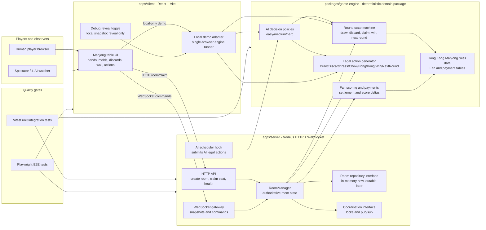
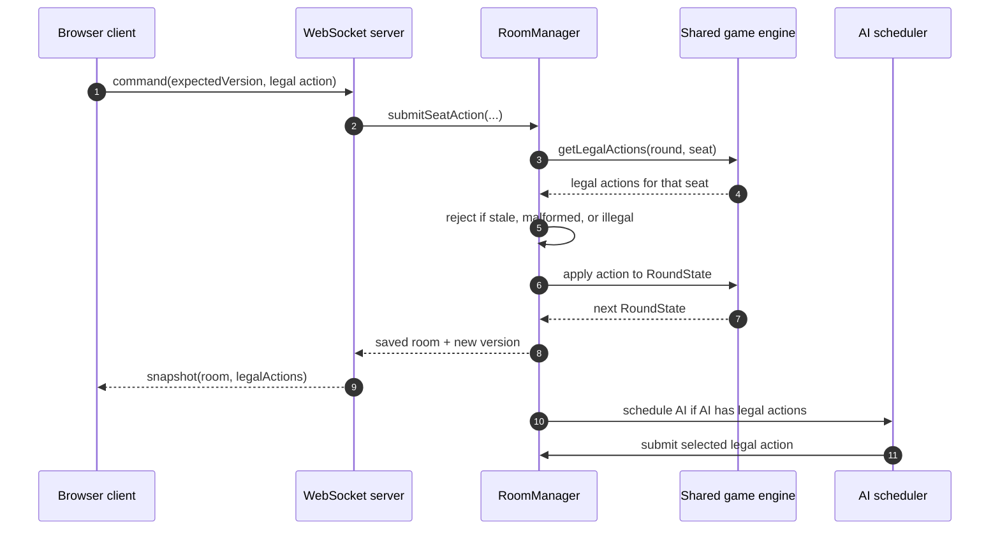
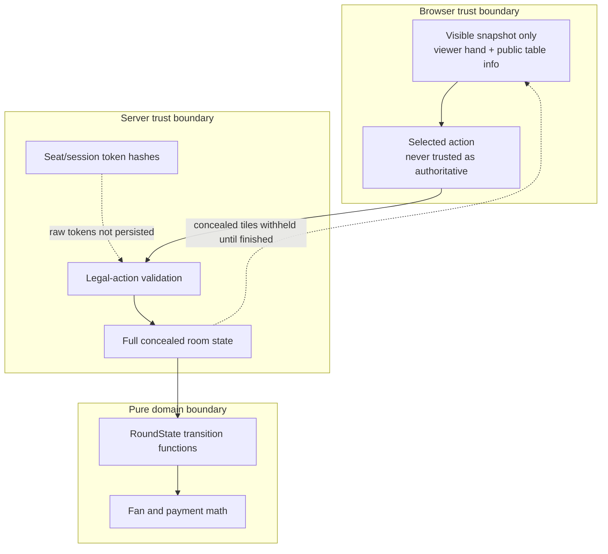
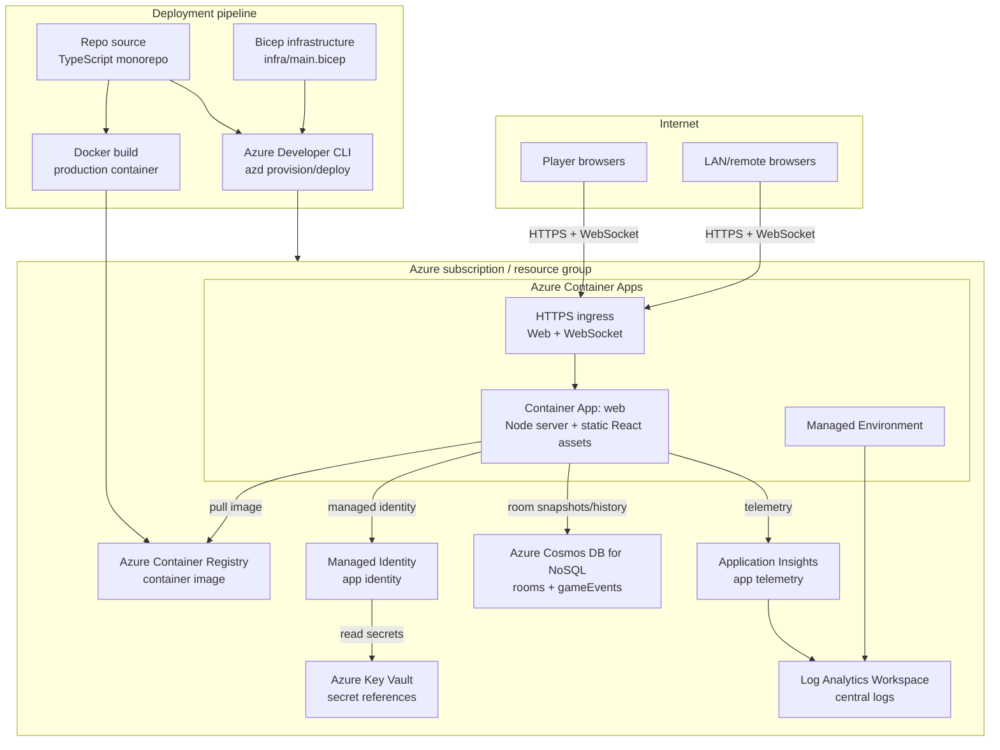
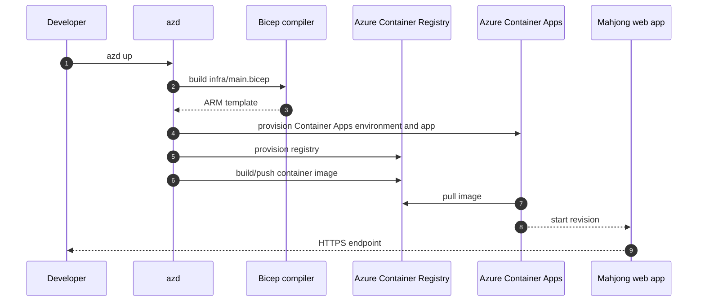

# Architecture Diagrams

This document captures the Hong Kong Mahjong application architecture in a product-spec and architecture-review friendly format. The diagrams use Mermaid so they render directly in GitHub Markdown.

## 1. Product requirements traceability

| Product requirement | Architecture support |
| --- | --- |
| Four players per table | Room state owns exactly four seats: East, South, West, North. |
| AI seats by default | Room creation initializes all seats as AI; human takeover changes seat controller. |
| Human takeover | Private room/seat claim token flow authorizes a browser session to control one seat. |
| Full gameplay | Shared game engine owns wall, draws, discards, claims, melds, wins, payments, next-round flow. |
| Claim notifications | Server derives legal actions per seat and emits action-required WebSocket prompts. |
| Adjustable Fan table | Engine scoring reads rules/config data; UI exposes minimum Fan and scoring defaults. |
| AI/player action parity | AI and humans select from the same `LegalAction` union. |
| Reveal all hands after win/draw | Finished-round snapshots reveal all concealed hands and settlement details. |
| Local/LAN play | React client, Node server, and shared engine run locally; LAN script binds to `0.0.0.0`. |
| Azure deployability | Docker, AZD, and Bicep target Azure Container Apps with managed backing services. |

## 2. Application code architecture

This is the C4-style container view of the codebase.

### Runtime command flow

### Privacy and trust boundaries

## 3. Azure deployment architecture

This diagram reflects the prepared `azure.yaml`, `Dockerfile`, and `infra\main.bicep` deployment target.

### Azure resource responsibility matrix

| Azure resource | Responsibility | Architecture standard addressed |
| --- | --- | --- |
| Azure Container Apps | Hosts the unified Node server and built React assets; current deployment is capped at one replica while room coordination is in memory. | Reliability and operational simplicity. |
| Azure Container Registry | Stores the production container image deployed by AZD. | Supply-chain control and repeatable deployment. |
| Managed Identity | Gives the app identity-based access to Azure resources. | Least privilege and secret minimization. |
| Key Vault | Provides a standard location for future secret/config references. | Centralized secret management. |
| Cosmos DB for NoSQL | Planned durable room/game state, score ledgers, and game event history. | Data durability and horizontal scalability. |
| Application Insights | Application traces, request telemetry, and runtime diagnostics. | Observability. |
| Log Analytics | Central log and metrics workspace for Container Apps and App Insights. | Operations and incident response. |

## 4. Deployment flow

## 5. Architecture standards checklist

| Standard area | Current implementation |
| --- | --- |
| C4-style documentation | System context, container, runtime flow, and deployment diagrams are documented in Mermaid. |
| Single source of domain truth | `packages\game-engine` owns rule and scoring logic used by client/server/AI/tests. |
| Server authority | Server validates action shape, version, seat session, and legal action before mutation. |
| Encapsulation | UI consumes snapshots; domain logic does not depend on React or WebSocket code. |
| Security boundaries | Raw seat tokens are bearer secrets; server stores token hashes; concealed hands are withheld until round finish. |
| Scalability boundary | Repository and coordination interfaces keep the current single-replica in-memory deployment separate from future durable production backing services. |
| Observability | Azure plan includes Application Insights and Log Analytics. |
| Resilience | Deterministic room transitions and version checks prevent stale command races. |
| Testability | Unit, integration, simulation, and Playwright suites validate engine/server/UI behavior locally. |
| Deployability | Docker + AZD + Bicep define repeatable Azure Container Apps deployment. |

## 6. Follow-up architecture work

1. Implement durable repository and distributed coordination adapters behind the existing interfaces.
2. Add durable game history and replay views from event records.
3. Add production-grade auth if private claim links are no longer sufficient.
4. Add live dashboards for command latency, room count, AI decisions, and failed actions.
5. Add multi-region disaster recovery if the product requires regional failover.
